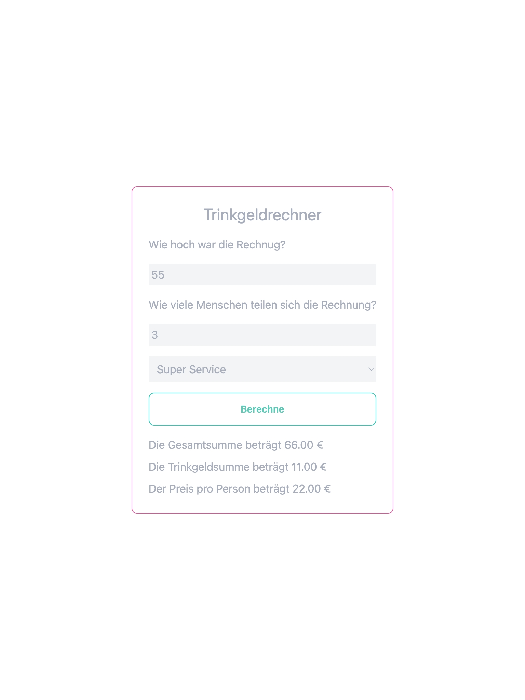

# Trinkgeldrechner

## Beschreibung

Bei diesem Projekt geht es darum einen Trickgeldrechner zu erstellen. Es gibt drei Eingabefelder, wobei das letzte aus einem Dropdown Menü besteht. Nach der Betätigung des Buttons wird die Gesamtsumme, die Höhe des Trinkgeldes und der Betrag für jede Person (was nur in Deutschlad gemacht wird) angegeben.

## Funktionalität

Im oberen Feld wird der Rechnugsbertrag eingegeben. Im nachfoldenden Feld wird die Personenanzahl eingegen. Im letzten Menü-Punkt wird der Service bewertet. Mit dem Button wird dann die Funktion/ Rechnung gestartet. 

## Technologien

**Markup:**  

**Styling:**  

**IDE:**  

**Version Control:**  

## Getting Started

 Um diesen Rechner zu verwenden sollte das nachfolgende Repo verwendet werden:

<a>https://github.com/DeborahAleaKoch/TypeScriptExercises/tree/main/src/TrinkgeldRechner</a>

